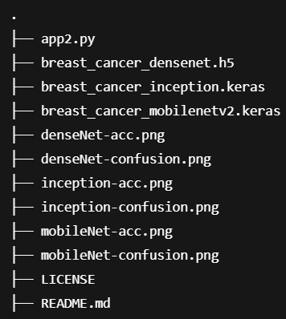
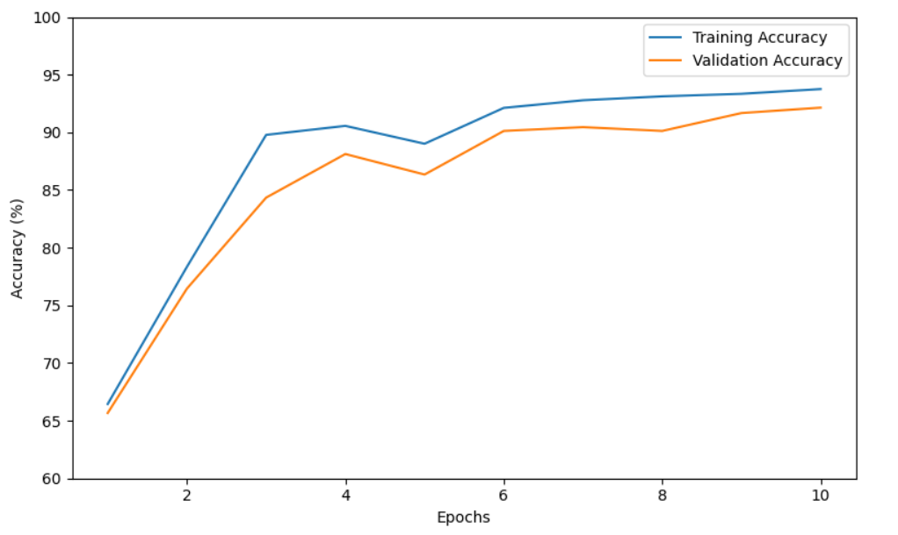
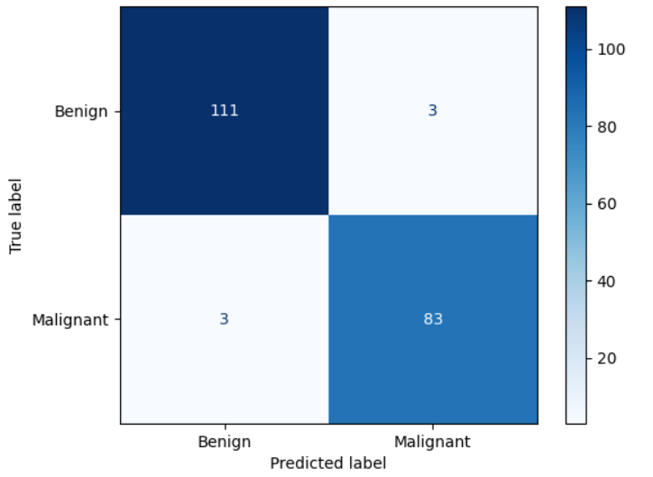
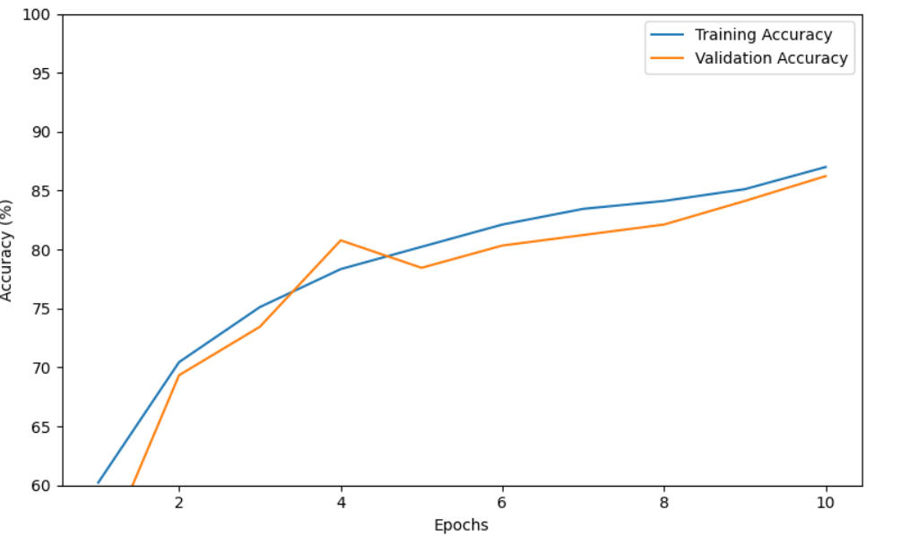
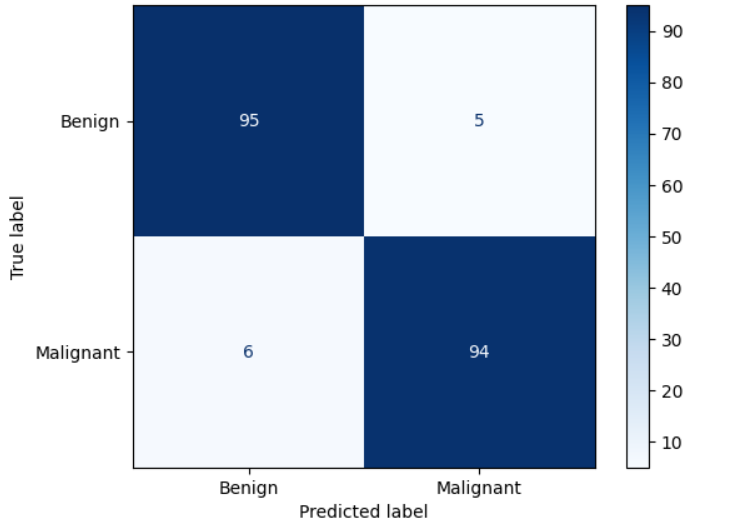
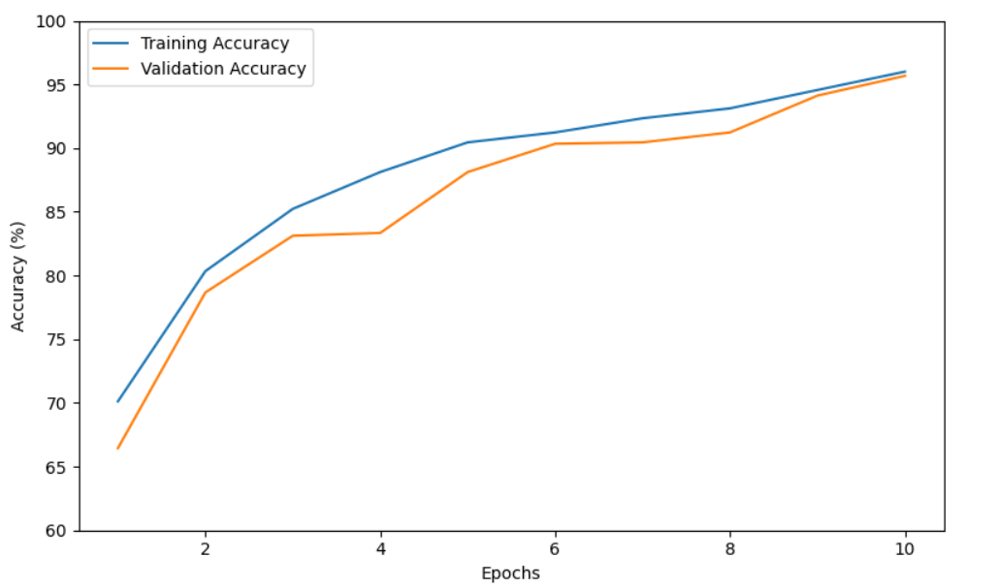
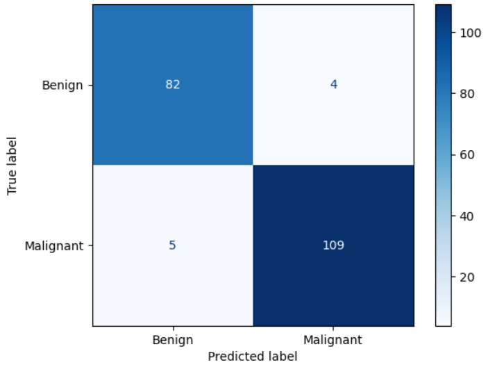

# 🧪 Breast Cancer Detection Interface using Streamlit

This project provides a user-friendly **Streamlit web interface** to test deep learning models (MobileNetV2, InceptionV3, DenseNet121) trained for **Breast Cancer Cell Classification**. Users can upload microscopic cell images and receive predictions indicating whether the image is **Benign (B)** or **Malignant (M)**.

## 📂 Project Structure



---

## ✅ Features

- Upload and classify microscopic breast cancer images
- Choose between three models:
  - **MobileNetV2** – lightweight and fast
  - **InceptionV3** – deep architecture for high accuracy
  - **DenseNet121** – great for medical imaging
- Displays prediction result and confidence
- Simple browser-based interface

---

## 🚀 How to Run

### 1. Setup Environment

Create a virtual environment (recommended):

```bash
python -m venv venv
source venv/bin/activate      # On Windows: venv\Scripts\activate

pip install streamlit tensorflow pillow

streamlit run app2.py

Ctrl+left click on localhost link that will be provided.

```

## 📊 Model Evaluation
| Model	| Accuracy Plot	| Confusion Matrix |
|----------|-----------------|-----------------|
| MobileNetV2	|  |  |
| InceptionV3	|  |  |
| DenseNet121	|  |  |

## 📌 Notes
Make sure the .keras or .h5 model files are in the root directory.

Only image formats like .jpg, .jpeg, or .png are supported.

Models were trained on augmented cytopathological breast cancer data using Keras and TensorFlow.
